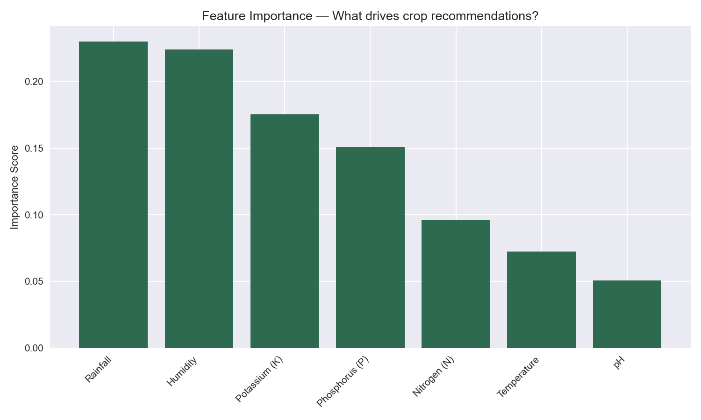
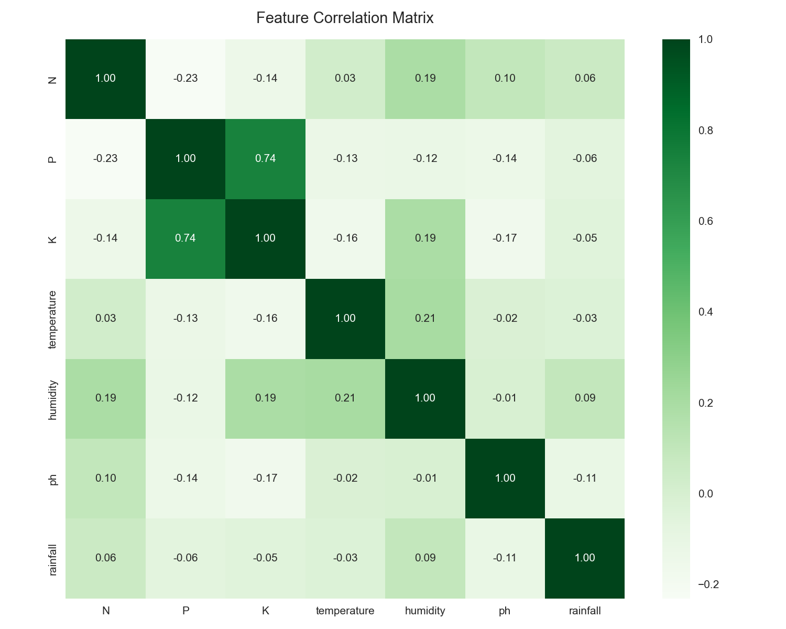

# 🌾 FarmSense — Smart Crop Advisor


Smart crop recommendations for smallholder farmers using ML + real-time weather data.

**Live Demo:** [farmsense-advisor.streamlit.app](https://farmsense-advisor.streamlit.app)  
**API:** [farmsense-api-oj7k.onrender.com](https://farmsense-api-oj7k.onrender.com/api/health)

---

## The Problem

India has 100M+ smallholder farmers making crop decisions based on intuition with no access to data-driven guidance. Wrong crop selection leads to yield failure and rural debt. FarmSense provides free, simple, bilingual (English + Hindi) crop advisory using live weather data and ML.

---

## Features

- 🌱 Crop recommendation from soil NPK, pH, and live weather
- 🌤️ Real-time weather via OpenWeatherMap API
- ⚡ 1-hour TTL caching to manage API rate limits
- 🦠 Disease risk scoring based on humidity + temperature
- 🌐 Bilingual UI — English + Hindi
- 📊 Request logging dashboard with recent predictions

---

## Model Performance

| Metric           | Score                         |
| ---------------- | ----------------------------- |
| Test Accuracy    | 99.55%                        |
| Cross-validation | 99.50% ± 0.36%                |
| Training samples | 2,200                         |
| Crops supported  | 22                            |
| Algorithm        | RandomForest (100 estimators) |

---

## Architecture

User → Streamlit UI → Flask REST API → OpenWeatherMap API
↓
RandomForest Model
↓
Disease Risk Engine
↓
SQLite Request Logger

---

## Tech Stack

| Layer        | Technology                         |
| ------------ | ---------------------------------- |
| ML           | scikit-learn, RandomForest, pandas |
| Backend      | Flask, REST API, SQLite            |
| Frontend     | Streamlit, bilingual UI            |
| External API | OpenWeatherMap                     |
| Deploy       | Render (API), Streamlit Cloud (UI) |
| CI/CD        | GitHub Actions                     |

---

## Local Setup

```bash
git clone https://github.com/swayamrthakur/FarmSense.git
cd FarmSense
python -m venv venv
venv\Scripts\activate
pip install -r requirements.txt
```

Add your API key to `.env`:
OPENWEATHER_API_KEY=your_key_here

Train the model first:

```bash
# Open notebooks/01_eda_and_training.ipynb and run all cells
```

Run the app:

```bash
# Terminal 1
python -m app.main

# Terminal 2
streamlit run streamlit_app.py
```

---

## Assets



